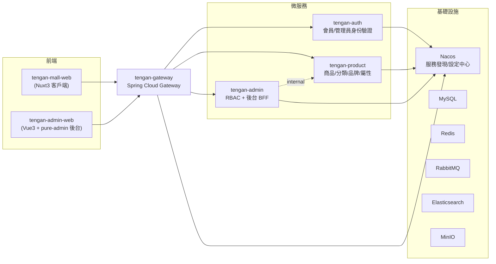

# 天願商城 tengan-mall

以 [gulimall](https://github.com/gulimall) 為靈感、針對台灣市場重新設計的微服務電商系統。這是一個 Java 後端工程師的作品集專案，用來展示微服務架構、DDD 分層、Spring Cloud Alibaba、zero-trust 身份驗證、RBAC 權限管理等後端工程能力，後端服務**全部從零重寫**，不沿用任何範本專案的既有程式碼。

## 架構概覽



**身份驗證採 zero-trust 模型**：Gateway 只做簽章與過期檢查，原樣轉發 JWT，不翻譯成明文 header 讓下游信任——沒有 mTLS/service mesh 前提下，明文 header 在內網可被偽造，屬於 OWASP API2 Broken Authentication 反模式。服務對服務呼叫另外走 OAuth2 Client Credentials（`tengan-auth` 自建 Spring Authorization Server 簽發 Service JWT）。

## 技術棧

| 分類 | 技術 |
|---|---|
| 後端語言/框架 | JDK 21、Spring Boot 3.3.5、Spring Cloud 2023.0.3、Spring Cloud Alibaba 2023.0.3.2 |
| 服務治理 | Nacos（服務發現 + 設定中心）、Spring Cloud Gateway |
| 身份驗證 | Spring Security OAuth2 Resource Server / Authorization Server、Nimbus JOSE+JWT |
| 持久層 | MySQL 8.4、MyBatis-Plus、Flyway |
| 快取/訊息 | Redis、RabbitMQ |
| 搜尋/物件儲存 | Elasticsearch、MinIO |
| 前台前端 | Nuxt 3、Nuxt UI、Pinia、TypeScript |
| 後台前端 | Vue 3、pure-admin、Element Plus、Vite、TypeScript |
| 容器化 | Docker Compose（一鍵啟動全部基礎設施） |

## 目錄結構

```
tengan-mall/
├── backend/                     # 微服務（Maven 多模組）
│   ├── tengan-gateway/          # API Gateway（:88）
│   ├── tengan-auth/             # 會員身份驗證 + Spring Authorization Server（:9010）
│   ├── tengan-admin/            # 後台 RBAC + 各網域後台 BFF（:9020）
│   ├── tengan-product/          # 商品網域：分類/品牌/規格屬性/SPU/SKU（:9030）
│   └── tengan-jwt-verification-starter/  # 共用 JWT 驗證邏輯的內部 starter
├── frontend/
│   ├── tengan-mall-web/         # 客戶端前台（Nuxt3，mock-first 開發）
│   └── tengan-admin-web/        # 後台管理前端（pure-admin）
├── infra/                       # 基礎設施初始化腳本（MySQL init 等）
├── docker-compose.yml           # 一鍵啟動 MySQL/Redis/Nacos/RabbitMQ/ES/MinIO 等
└── .env.example                 # docker-compose 用的環境變數範本
```

## 開發進度

後端採 Phase 0~11 的順序逐步開發，目前狀態：

- ✅ **Phase 0 地基**：Maven 多模組、JWT 驗證 starter、Nacos config、Docker Compose 基礎設施
- ✅ **Phase 1 Gateway + Auth + Admin RBAC**：Gateway zero-trust 轉發、會員/管理員雙 JWT 體系、`tengan-admin` 完整 RBAC（角色/選單/操作日誌）
- 🚧 **Phase 2 Product + Search**：`tengan-product` 的 Category/Brand/規格屬性(BaseAttr/SaleAttr)/SPU/SKU 已完整（domain + 後台管理頁面），`tengan-search`（Elasticsearch 索引 + 篩選聚合）尚未開始
- ⬜ Phase 3~11：Member / Cart / Inventory + Coupon / Order / Payment（綠界 ECPay）/ Wallet / Seckill / Media 尚未開始

`tengan-mall-web`（客戶端前台）目前是 mock-first 開發（首頁/搜尋/商品詳情/購物車/結帳/會員點數頁面都已用假資料完成排版與互動），尚未接上真正的後端 API。

## 快速開始

### 1. 啟動基礎設施

```bash
cp .env.example .env   # 依需要調整密碼，開發環境可直接用預設值
docker compose up -d
```

Nacos 主控台：http://localhost:8848/nacos（首次啟動需手動建立管理員帳號，見 `backend/tengan-auth` 啟動說明）

### 2. 啟動後端服務

用 IntelliJ IDEA 依序啟動 `backend/` 底下四個模組（`tengan-gateway`/`tengan-auth`/`tengan-admin`/`tengan-product`），JDK 需為 21。

### 3. 啟動前端

```bash
# 後台管理
cd frontend/tengan-admin-web
pnpm install
pnpm dev        # http://localhost:8090，預設帳號 admin / Admin@123

# 客戶端前台
cd frontend/tengan-mall-web
pnpm install
pnpm dev
```

## 設計上的幾個重點

- **Zero-trust 身份驗證**：Gateway 不解碼、不注入明文使用者 ID，下游服務各自驗簽；管理員與一般會員是兩條完全獨立的 JWT 體系（各自獨立 RSA keypair），不共用帳密表。
- **DDD 分層 + CQRS-lite**：聚合根邊界依「是否需要交易一致性保護」判斷（例如 `Spu`/`Sku` 合併成一個聚合根，因為上架需要「至少一顆 SKU」的不變條件）；高頻讀取路徑（如商品詳情頁查詢）另開輕量 Port 直接查表，不經過聚合根組裝，避免為了讀單筆資料載入整包關聯資料。
- **後台是 BFF，不是另開一套業務邏輯**：`tengan-admin` 呼叫其他網域服務的 internal 端點取得資料與執行寫入，業務規則的真相只在對應網域服務裡，後台端只做權限驗證、稽核紀錄、資料轉發。
- **審計與可追溯性**：後台每個寫入操作都會轉發原始 JWT（`X-Identity-Assertion`）到下游服務，各服務各自記錄操作日誌（`oper_log`/`product_oper_log`），不集中到單一稽核服務，避免跨服務耦合。
